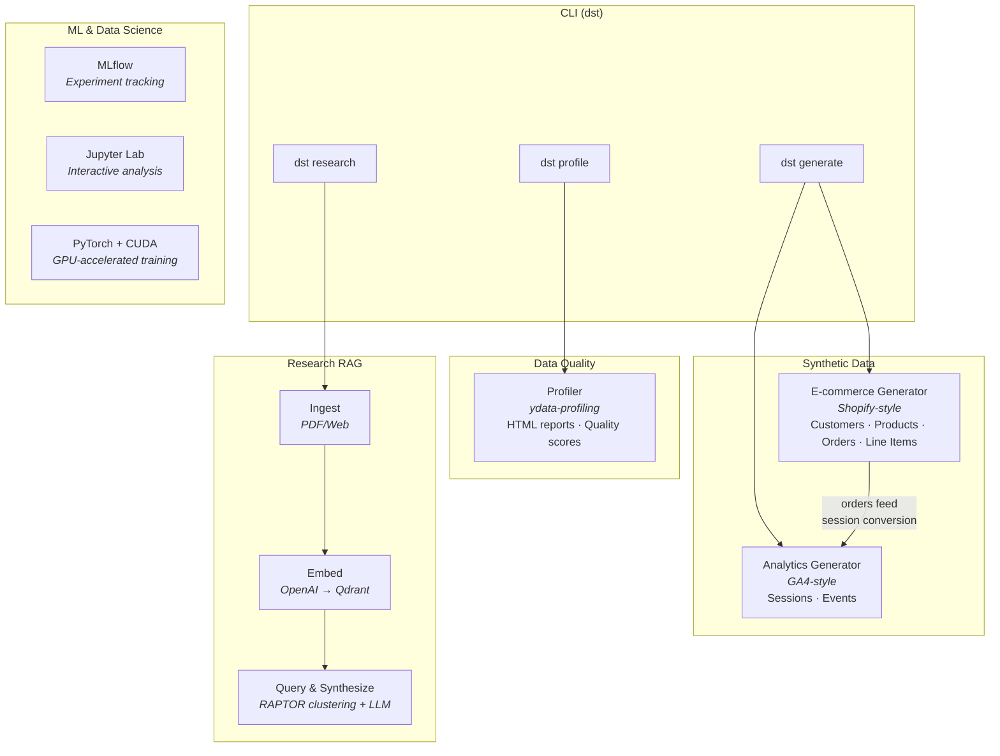

# semops-data

Data platform for the [SemOps](https://semops.ai) system — coherence measurement, operational analytics, synthetic data generation, data quality profiling, and AI-powered research synthesis.

## What This Is

This is the data platform for [SemOps](https://semops.ai) — where measurement, analytics, and data science capabilities live. Over time, it will take on a more traditional data platform role — metrics ingestion from external services, storage, transformation, analytics outputs - similar to a [Databricks](https://www.databricks.com/) + [Snowflake](https://www.snowflake.com/) stack.

Today, the analytical capabilities are purpose-built for some of the specific and novel requirements of Semantic Operations. There are four foundational capabilities you can install and run. Unlike other repos in the organization, the core capabilities are designed to work standalone — no multi-repo deployment required.

1. **ML and experiment tracking** — GPU-enabled development environment (PyTorch, CUDA) with [MLflow](https://mlflow.org/) experiment tracking, Jupyter Lab, and training workflows for classification, regression, and hyperparameter tuning. Coherence scoring experiments for the broader SemOps system run here — testing different approaches (embedding similarity, NLI contradiction detection, LLM-as-judge) to measure how well content aligns with its source patterns.
2. **Synthetic data generators** — Shopify-style e-commerce transactions (customers, products, orders, line items) and GA4-style web analytics (sessions, events) with referential integrity across tables. Orders reference real customers, analytics sessions tie to order conversions, and everything is reproducible via random seeds.
3. **Research RAG pipeline** — A [RAPTOR](https://arxiv.org/abs/2401.18059)-inspired meta-analysis workflow: ingest PDFs and web sources, chunk and embed documents, cluster embeddings to discover themes, then synthesize structured reports via LLM. In the SemOps context, this serves three roles: researching new 3P patterns for adoption into the domain model, onboarding technical documentation for agentic management of infrastructure, and adapting the SemOps core when applying the framework to new domains.
4. **Data quality profiling** — Automated profiling reports and quality assessments for any tabular dataset. Generates interactive HTML reports with distributions, correlations, missing data analysis, and quality scores.

These capabilities address established data engineering principles — [data profiling](https://en.wikipedia.org/wiki/Data_profiling), [data lineage](https://en.wikipedia.org/wiki/Data_lineage), [synthetic data generation](https://sdv.dev/), and [medallion architecture](https://www.databricks.com/glossary/medallion-architecture) (progressive data enrichment) — applied through the lens of the SemOps [strategic design](https://github.com/semops-ai/semops-dx-orchestrator). Synthetic data and profiling build toward production-scale data engineering. Research RAG implements the semantic ingestion pattern. ML experiments provide the measurement infrastructure for coherence scoring across the system.

Part of the [semops-ai](https://github.com/semops-ai) organization. For system-level architecture and how all six repos relate, see [semops-dx-orchestrator](https://github.com/semops-ai/semops-dx-orchestrator).

**What this repo is NOT:**

- Not a production data pipeline framework yet — the current capabilities generate and profile data for learning and testing, with production analytics planned
- Not a replacement for enterprise ETL/ELT tools (Airflow, dbt Cloud, Fivetran) — it implements the same patterns at reference-implementation scale
- Not a SaaS product — it runs locally, there is no hosted version
- Not concept documentation (see [semops-docs](https://github.com/semops-ai/semops-docs) for framework theory)

## How to Read This Repo

**If you want to understand the platform vision:**
Start with [What This Is](#what-this-is) for the data platform framing, then see [Key Decisions](#key-decisions) for why the capabilities are designed the way they are.

**If you want to generate synthetic data and profile it:**
Start with the [What It Produces](#what-it-produces) section for CLI examples, then see [Quick Start](#quick-start) to get running.

**If you want to understand the research RAG pipeline:**
The [Research Synthesis](#research-synthesis) subsection explains the RAPTOR-inspired workflow — how it ingests, clusters, and synthesizes.

**If you're coming from the orchestrator and want implementation depth:**
This repo implements the Data Platform bounded context described in [semops-dx-orchestrator](https://github.com/semops-ai/semops-dx-orchestrator#repo-map). It uses infrastructure from [semops-core](https://github.com/semops-ai/semops-core) for the research pipeline but runs independently for synthetic data and profiling.

## Architecture



The four capabilities are independent — you can generate synthetic data without using research RAG, profiling works on any CSV or Parquet file, and the ML environment supports any PyTorch workflow. Core functionality (synthetic data, profiling) requires no external services beyond Python libraries. The research pipeline uses [Qdrant](https://qdrant.tech/) for vector storage (available from [semops-core](https://github.com/semops-ai/semops-core) or as a standalone container). The ML environment runs in a GPU-enabled DevContainer with PyTorch and CUDA pre-configured.

## What It Produces

### ML and Coherence Experiments

The platform ships with a GPU-enabled DevContainer (PyTorch, CUDA) and [MLflow](https://mlflow.org/) for experiment tracking. Training workflows for classification, regression, and hyperparameter tuning are included as Jupyter notebooks. MLflow tracks parameters, metrics, and artifacts across runs — start the UI to compare experiments visually.

The SemOps system uses this environment for coherence scoring experiments: testing different approaches (embedding similarity, NLI contradiction detection, LLM-as-judge) to measure how well content aligns with its source patterns. As the platform matures, this is where metrics from external services (Google Analytics, marketing platforms, CRM) will be ingested and analyzed alongside internal coherence signals.

### Synthetic Data

```bash
dst generate --customers 500 --products 100 --orders 5000 --sessions 10000
```

Outputs six CSV files with cross-table referential integrity:

| File | Contents |
| ---- | -------- |
| `shopify_customers.csv` | Customer profiles with addresses and segments |
| `shopify_products.csv` | Product catalog with categories, prices, and inventory |
| `shopify_orders.csv` | Orders referencing real customer IDs, with totals and timestamps |
| `shopify_line_items.csv` | Order line items referencing real product IDs and order IDs |
| `ga4_sessions.csv` | Web analytics sessions with traffic sources and device info |
| `ga4_events.csv` | Session events including conversion events tied to orders |

Row counts are configurable and all generators accept a random seed for reproducibility. The e-commerce data uses [SDV](https://sdv.dev/) (Synthetic Data Vault) for realistic distributions and [Faker](https://faker.readthedocs.io/) for identity generation.

### Data Profiling

```bash
dst profile samples/raw/shopify_customers.csv -o customer_report.html
```

Generates an interactive HTML report powered by [ydata-profiling](https://docs.profiling.ydata.ai/) with variable distributions, correlation matrices, missing data analysis, duplicate detection, and a data quality score. Use `--minimal` for a faster summary on large datasets.

### Research Synthesis

The research pipeline follows a RAPTOR-inspired workflow — cluster first, then synthesize per theme:

```bash
# 1. Ingest sources from manifest
dst research ingest

# 2. Query the corpus with LLM synthesis
dst research query "What are the main causes of data silos in enterprise organizations?"

# 3. Search for similar content without synthesis
dst research search "measurement ROI"
```

Ingestion parses PDFs and web pages, chunks them, generates embeddings via OpenAI, and stores vectors in Qdrant. Querying retrieves relevant chunks, clusters them with K-means to discover thematic groupings, then synthesizes structured reports (problem space, causes, solutions) via Claude. This surfaces patterns across the corpus that point-question RAG would miss.

Within SemOps, the research pipeline is used to evaluate candidate 3P patterns (e.g., surveying RAPTOR literature before adopting it), onboard technical documentation for infrastructure that agents need to manage, and explore how the framework adapts to new industry domains.

The research pipeline requires Qdrant for vector storage and API keys for OpenAI (embeddings) and Anthropic (synthesis).

## Quick Start

```bash
# Install
pip install -e .

# Generate synthetic e-commerce + analytics data
dst generate --customers 200 --products 50 --orders 1000

# Profile a dataset
dst profile samples/raw/shopify_customers.csv

# For research RAG (requires Qdrant + API keys):
pip install -e ".[research]"
dst research ingest
dst research query "your question here"
```

The platform ships with a GPU-enabled DevContainer (PyTorch, CUDA) for ML workflows. Open in VS Code and select "Reopen in Container" for the full environment including Jupyter Lab and MLflow.

## Key Decisions

### 1. Referential Integrity in Synthetic Data

**Decision:** Generate synthetic datasets with cross-table foreign key relationships (customers referenced by orders, orders linked to analytics sessions) rather than independent random tables.

**Why:** Independent random tables are trivial to generate but useless for testing joins, aggregations, or pipeline logic. The value of synthetic data comes from structural realism — the relationships between tables matter more than the distributions within them. An order that references a real customer ID exercises the same code paths as production data.

**Trade-off:** More complex generation logic. Each generator must accept upstream DataFrames to maintain foreign key relationships, which limits parallelism. Worth it because the alternative — independent tables — produces data that does not exercise real pipeline patterns.

### 2. RAPTOR-Inspired Clustering Over Question-Driven RAG

**Decision:** Use embedding-based clustering (K-means on chunk embeddings) to discover themes across research sources, rather than requiring users to formulate questions upfront.

**Why:** Research synthesis is exploratory. When ingesting a corpus of papers on a topic, the interesting patterns often emerge from what the sources have in common — not from what you already know to ask. Clustering first, then synthesizing per cluster, surfaces themes the user might not have anticipated. This complements question-driven RAG, which the CLI also supports for directed queries.

**Trade-off:** Requires enough sources for clustering to be meaningful. With fewer than 5-6 sources, question-driven RAG produces better results. The CLI supports both approaches — `query` for directed questions, `synthesize` for corpus-wide theme discovery.

### 3. Standalone-First, System-Optional

**Decision:** Design core capabilities (synthetic data, profiling) to work without any SemOps infrastructure, while research RAG benefits from shared services.

**Why:** A toolkit people can use must not require them to deploy an entire multi-repo system first. The synthetic data generators and profiler have zero external dependencies beyond Python libraries. The research pipeline needs a vector store, but Qdrant can be started as a standalone container without the full [semops-core](https://github.com/semops-ai/semops-core) stack.

**Trade-off:** Some duplication of configuration that could be centralized. The research module has its own Qdrant connection config rather than inheriting from a shared service layer. This is acceptable because it lowers the barrier to entry.

## Status

| Component | Maturity | Notes |
| --------- | -------- | ----- |
| MLflow experiment tracking | Stable | Parameter, metric, and artifact tracking across runs |
| Coherence scoring experiments | Experimental | Multiple scoring approaches under evaluation |
| Synthetic data (e-commerce) | Stable | Shopify-style with referential integrity, reproducible via seed |
| Synthetic data (analytics) | Stable | GA4-style sessions and events, tied to e-commerce conversions |
| Data profiling | Stable | ydata-profiling integration, quality assessments |
| Research RAG pipeline | Beta | PDF/web ingestion, embedding, RAPTOR clustering, LLM synthesis |
| CLI (`dst`) | Beta | generate, profile, and research commands functional |
| DevContainer (GPU) | Stable | PyTorch CUDA, MLflow, Jupyter Lab |
| External metrics ingestion | Planned | Google Analytics, marketing platforms, CRM data |
| Data lineage | Planned | OpenLineage + Marquez integration designed, not yet implemented |

This is a single-person project in active development. The ML environment, synthetic data generators, and profiler are stable and used regularly, while the research pipeline, metrics ingestion, and lineage tracking are evolving.

## References

### Related

- **[semops-dx-orchestrator](https://github.com/semops-ai/semops-dx-orchestrator)** — System architecture, cross-repo coordination, and design principles
- **[semops-core](https://github.com/semops-ai/semops-core)** — Schema, knowledge graph, and infrastructure services (Qdrant, document processing)
- **[semops-docs](https://github.com/semops-ai/semops-docs)** — Framework theory, concepts, and foundational research
- **[semops.ai](https://semops.ai)** — Framework concepts and the case for Semantic Operations
- **[timjmitchell.com](https://timjmitchell.com)** — Blog, thought leadership, and project narrative

### Influences

- **[RAPTOR](https://arxiv.org/abs/2401.18059)** (Sarthi et al.) — Recursive abstractive processing for tree-organized retrieval
- **[SDV](https://sdv.dev/)** (DataCebo) — Synthetic Data Vault for structured data generation
- **[OpenLineage](https://openlineage.io/)** (LF AI & Data) — Industry standard for data lineage event emission
- **[W3C PROV](https://www.w3.org/TR/prov-overview/)** — Provenance ontology, conceptual model for lineage design
- **[ydata-profiling](https://docs.profiling.ydata.ai/)** — Automated data profiling and quality analysis

## License

[MIT](LICENSE)
