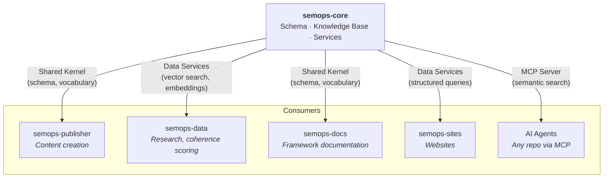
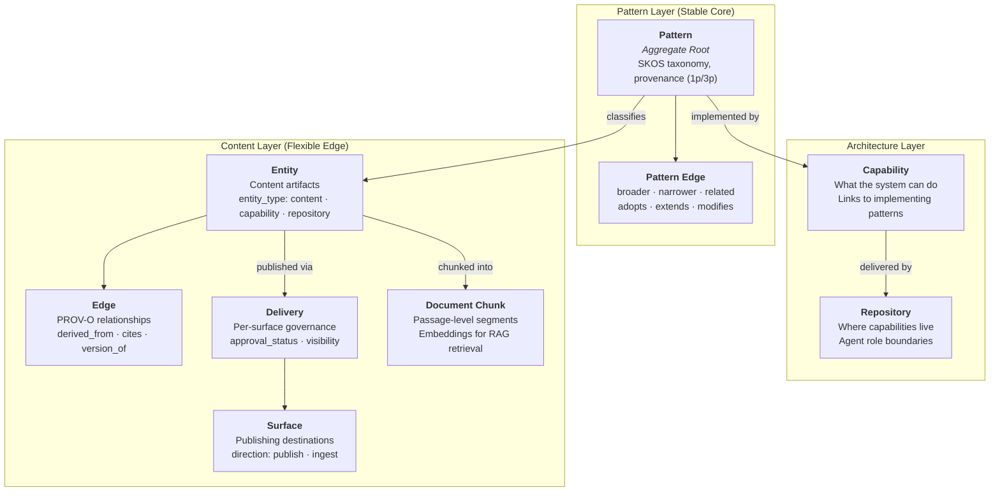
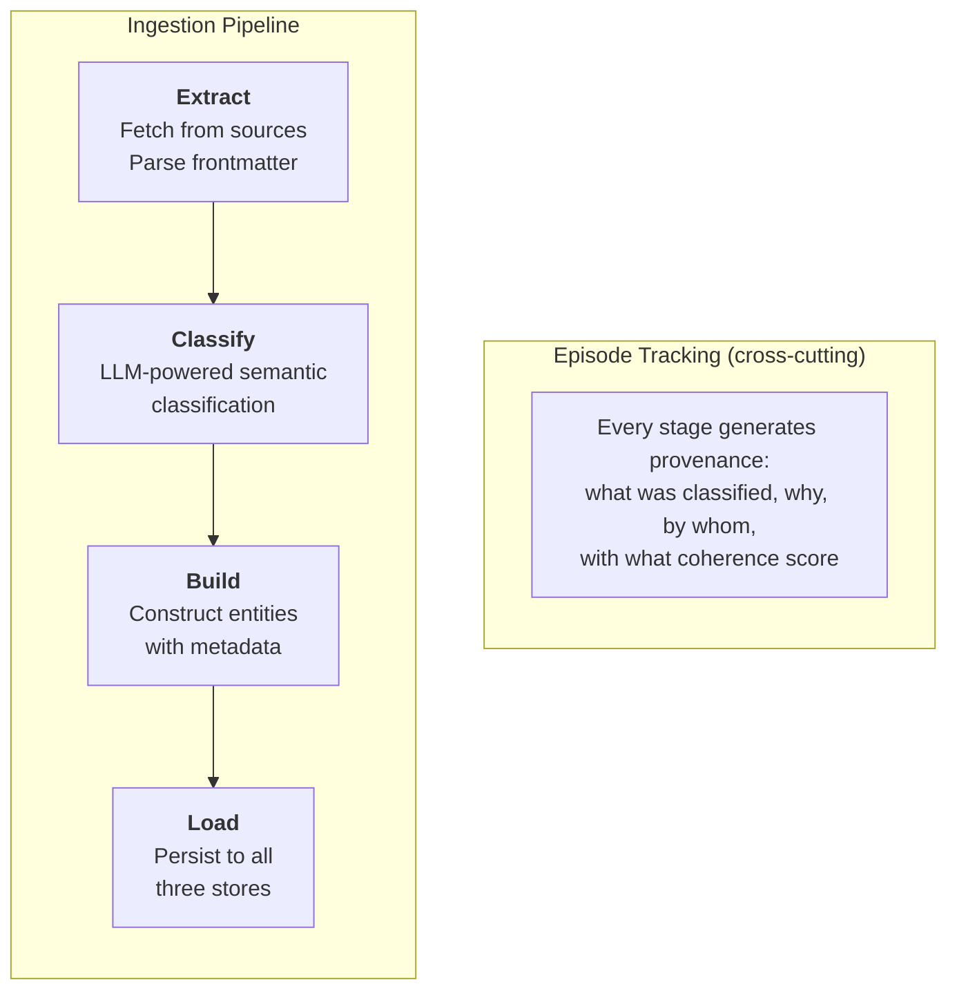

# semops-core

Domain schema, knowledge base, and shared infrastructure services for the [SemOps](https://semops.ai) multi-repo system.

## What This Is

This repo is the **foundation layer** of Semantic Operations — the schema, knowledge base, and services that all other repos in the [semops-ai](https://github.com/semops-ai) organization depend on.

It owns three things:

1. **The domain model** — Architecture is central to Semantic Operations. One of the framework's pillars, [Explicit Architecture](https://github.com/semops-ai/semops-docs/blob/main/SEMANTIC_OPERATIONS_FRAMEWORK/EXPLICIT_ARCHITECTURE/README.md), encodes organizational strategy into system structure so that humans and AI operate from shared meaning. The foundation for this is [Domain-Driven Design](https://github.com/semops-ai/semops-docs/blob/main/SEMANTIC_OPERATIONS_FRAMEWORK/EXPLICIT_ARCHITECTURE/domain-driven-design.md) (DDD) — an architectural approach that organizes software around business meaning rather than technical layers. This repo's schema implements that architecture. Its central concept is a [Pattern](https://github.com/semops-ai/semops-docs/blob/main/SEMANTIC_OPERATIONS_FRAMEWORK/SEMANTIC_OPTIMIZATION/patterns.md) — a semantic unit that everything else in the system traces back to. A shared vocabulary document defines every term in the domain, and established standards ([SKOS](https://www.w3.org/2004/02/skos/), [PROV-O](https://www.w3.org/TR/prov-o/), Dublin Core) are adopted directly into the schema rather than invented from scratch.
2. **The knowledge base** — knowledge matures through quality tiers (raw → enriched → curated), with semantic search, corpus-organized retrieval, and lineage tracking across three complementary stores
3. **The service layer** — semantic search, agent access, and ingestion pipelines with agentic lineage

This is a reference implementation. You are welcome to study the schema, adapt the patterns, and learn from the decisions — but this is not a library to install or a database to connect to. For system-level architecture and how all six repos relate, see [semops-dx-orchestrator](https://github.com/semops-ai/semops-dx-orchestrator).

**What this repo is NOT:**

- Not a general-purpose knowledge graph framework
- Not a standalone product — it provides services consumed by other SemOps repos
- Not concept documentation (see [semops-docs](https://github.com/semops-ai/semops-docs) for framework theory)

## Service Interface

semops-core sits at the center of the system, providing schema, search, and infrastructure to every other repo.

For the complete system architecture, see [semops-dx-orchestrator](https://github.com/semops-ai/semops-dx-orchestrator#system-context).

## How to Read This Repo

**If you want to understand the domain model:**
Start with the [Domain Model](#domain-model) section below, then look at the Ubiquitous Language for precise definitions of every domain term.

**If you want to understand how knowledge is stored and retrieved:**
The [Knowledge Base](#knowledge-base) section covers how knowledge matures through quality tiers and the storage architecture behind it.

**If you want to see how data enters the system:**
The [Ingestion & Provenance](#ingestion--provenance) section explains the pipeline and its agentic lineage audit trail.

**If you're coming from the orchestrator and want implementation depth:**
This repo implements the domain model described in [semops-dx-orchestrator](https://github.com/semops-ai/semops-dx-orchestrator#architecture-overview). The sections below show how the schema, search, and provenance work.

## Domain Model

The domain model is organized into three layers (see [semops-dx-orchestrator](https://github.com/semops-ai/semops-dx-orchestrator#three-layer-domain-model) for the conceptual overview). This section goes deeper into how those layers are implemented in the schema.

### Three-Layer Schema

**Pattern Layer (Stable Core)** — [SKOS](https://www.w3.org/2004/02/skos/)-aligned taxonomy with provenance tracking. Patterns connect through two relationship families: SKOS hierarchy (broader, narrower, related) for classification, and adoption lineage (adopts, extends, modifies) for tracking how organizational patterns derive from standards.

**Architecture Layer (Strategic Design)** — Capabilities, repositories, and integration relationships formalized as first-class domain objects. Every capability traces to at least one pattern. This layer answers "what can the system do?" and "where does each capability live?"

**Content Layer (Flexible Edge)** — Publishing artifacts classified by patterns, with [PROV-O](https://www.w3.org/TR/prov-o/) relationships for lineage (derived_from, cites, version_of) and per-surface governance for publishing. The same entity can be in different approval states on different publishing surfaces.

**Stable Core vs. Flexible Edge:** Entities with an assigned pattern are classified (stable). Entities without a pattern are unclassified (flexible edge) — awaiting classification through the [promotion loop](https://github.com/semops-ai/semops-docs/blob/main/SEMANTIC_OPERATIONS_FRAMEWORK/SEMANTIC_OPTIMIZATION/pattern-operations.md). New knowledge enters at the edge and gradually becomes structured.

### Ubiquitous Language

The schema is governed by a Ubiquitous Language document (currently v8.0.0) — a shared vocabulary used by all repos as a [Shared Kernel](https://github.com/semops-ai/semops-dx-orchestrator#how-repos-integrate). It defines every domain term, business rule, and constraint. This repo owns the document; other repos consume it. When a term's definition changes here, it changes everywhere.

### Adopted Standards

The schema builds on established standards rather than inventing from scratch:

| Standard | Role in Schema |
| -------- | -------------- |
| **[SKOS](https://www.w3.org/2004/02/skos/)** (W3C Simple Knowledge Organization System) | Pattern taxonomy — concept hierarchy and broader/narrower/related relationships |
| **[PROV-O](https://www.w3.org/TR/prov-o/)** (W3C Provenance Ontology) | Content lineage — derivation, citation, and versioning relationships between entities |
| **Dublin Core** | Attribution metadata — creator, rights, publisher on entities |
| **Schema.org** | Actor modeling — Person, Organization, Brand types |
| **DDD** (Domain-Driven Design) | Aggregate root pattern, bounded contexts, ubiquitous language |

## Knowledge Base

Knowledge in this system matures through three quality tiers, each with progressively richer semantic structure:

- **Raw** — Documents enter with minimal processing: text extraction, structure preservation, and provenance assignment. Content at this tier is queryable but unclassified.
- **Enriched** — Automated classifiers extract entities, assign SKOS classifications, detect relationships, and score for semantic coherence. Most agent queries operate at this tier.
- **Curated** — Human-reviewed content promoted to the stable corpus with full lineage, verified SKOS relationships, and implementation tracing.

Each tier has quality gates — automated scoring and human-in-the-loop approval — that govern promotion. The ingestion pipeline (described in [Ingestion & Provenance](#ingestion--provenance)) moves knowledge through these tiers, and the process itself generates knowledge: LLM classifications, detected edges, and coherence scores all become queryable artifacts.

### Storage Architecture

Three complementary stores serve different access patterns over the same domain model:

- **Relational database** (PostgreSQL with pgvector) — Primary store for the domain model: patterns, entities, edges, deliveries, and episode provenance. pgvector enables embedding-based similarity search for simple cases.

- **Vector database** (Qdrant; Weaviate, Milvus, and Pinecone serve the same role) — Dedicated semantic search index for high-throughput embedding queries. Used for passage-level retrieval and corpus-filtered search where the relational store would be too slow.

- **Knowledge graph** (Neo4j; Amazon Neptune and TigerGraph are alternatives) — Relationship traversal and pattern navigation. Enables "find everything connected to this pattern" queries that would be expensive as recursive joins in a relational model.

### Corpus Routing

Knowledge is organized into named corpora — core domain knowledge, deployment documentation, published content, research — for filtered retrieval. This lets agents search within a relevant subset rather than the entire knowledge base. Routing is configured declaratively: source paths and content types map to corpus assignments during ingestion.

### Query API

The query layer provides four search patterns: entity-level search (find content by semantic similarity), chunk-level search (passage retrieval for RAG), hybrid two-stage retrieval (find entities first, then retrieve relevant passages), and graph neighbor traversal (explore relationships from a starting point).

### Agent Access

Agents in any repo can query the knowledge base through an MCP (Model Context Protocol) server that exposes semantic search and corpus listing. This is how the knowledge base participates in agent workflows across the system — agents don't need direct database access or repo-specific configuration.

## Ingestion & Provenance

### How Knowledge Enters the System

Content flows through a four-stage pipeline where every byproduct becomes a queryable artifact:

Sources are configured declaratively — what to ingest, how to route to corpora, what attribution to apply. Classification uses LLM-powered semantic analysis to determine content type, primary concept, detected relationships, and concept ownership (1p vs 3p). Entities are built with full metadata, attribution, and embeddings, then persisted to all three stores simultaneously.

**Semantic Ingestion:** Every stage of the pipeline persists its output — LLM classifications, detected edges, coherence scores, concept ownership signals — as queryable knowledge artifacts. The ingestion process contributes to the domain model, not just populates it. This simplifies governance (every classification decision is auditable), follows DRY principles (one pipeline produces both content and its metadata rather than separate processing for each), and treats process outputs as data rather than throwaway logs. In most ETL (Extract, Transform, Load) and RAG pipelines, these intermediate results are discarded.

### Agentic Lineage

Every operation that modifies the domain model — ingest, classify, embed, create edge, publish — is tracked as an episode using [Graphiti](https://github.com/getzep/graphiti), a bi-temporal knowledge graph where each episode records what happened, when it was known, and what context was available. Episodes capture what patterns were retrieved, which agent made the decision, what model was used, and quality signals like coherence scores.

Agent observability tools like [Langfuse](https://langfuse.com/) track *what* an agent did — latency, token usage, trace flow. [Agentic Lineage](https://github.com/semops-ai/semops-docs/blob/main/SEMANTIC_OPERATIONS_FRAMEWORK/SEMANTIC_OPTIMIZATION/provenance-lineage-semops.md) extends this by tracking *why*: what context informed each decision and whether the output should be trusted. The result is an audit trail that answers "why was this classified this way?" not just "what changed in this row."

## Key Decisions

### 1. Three Stores, One Domain Model

**Decision:** Use three complementary databases rather than a single store.

**Why:** Each query pattern — structured lookups, semantic similarity, relationship traversal — maps naturally to a different store type. Forcing all three into one store means at least one pattern is inefficient. The domain model is the same across all three; only the access pattern differs.

**Trade-off:** Synchronization overhead. Data must be consistent across three stores during ingestion. The pipeline handles this atomically, but it's more complex than a single-store write.

### 2. Agentic Lineage (Not Row-Level Auditing)

**Decision:** Track operations as episodes with context, not as row-level change logs.

**Why:** The interesting question is "why was this classified this way?" not "what changed in this row." Episode context captures the patterns retrieved, the model used, and the coherence score. Row-level auditing captures only before/after values — useful for compliance, but not for understanding decisions.

**Trade-off:** More storage per operation and more complex to query than simple change tables. Worth it because decision provenance is central to the [Agentic Lineage](https://github.com/semops-ai/semops-docs/blob/main/SEMANTIC_OPERATIONS_FRAMEWORK/SEMANTIC_OPTIMIZATION/provenance-lineage-semops.md) thesis.

### 3. Corpus Routing Over Flat Search

**Decision:** Organize knowledge into named corpora rather than a single searchable index.

**Why:** Agents searching for deployment documentation should not wade through published blog posts. Corpus routing provides the filtering that makes semantic search practical as the knowledge base grows. Without it, relevance degrades as content volume increases.

**Trade-off:** Requires upfront routing configuration. Misrouted content becomes harder to discover until the routing rules are corrected.

## Status

| Component | Maturity | Notes |
| --------- | -------- | ----- |
| Domain schema | Stable | Three-layer model (v8.0.0), validated through daily use |
| Knowledge base | Beta | All three stores functional; query API evolving |
| Ingestion pipeline | Beta | Multi-source with LLM classification, episode provenance |
| Episode provenance | Beta | Tracking operational; analysis tooling in development |
| Semantic search | Beta | Entity-level, chunk-level, and hybrid search working |
| Agent access (MCP) | Beta | Functional across all repos |
| Coherence scoring | Experimental | Formula defined, scoring approaches under evaluation |

This is a single-person project in active development. The schema is stable and used daily, but individual components range from production-quality to experimental.

## References

### Related

- **[semops-dx-orchestrator](https://github.com/semops-ai/semops-dx-orchestrator)** — System architecture, cross-repo coordination, and design principles
- **[semops-docs](https://github.com/semops-ai/semops-docs)** — Framework theory, concepts, and foundational research
- **[semops-publisher](https://github.com/semops-ai/semops-publisher)** — AI-assisted content creation (consumes knowledge base)
- **[semops-data](https://github.com/semops-ai/semops-data)** — Research RAG and coherence scoring (consumes search services)
- **[semops.ai](https://semops.ai)** — Framework concepts and the case for Semantic Operations

### Influences

- **Domain-Driven Design** (Eric Evans) — Aggregate roots, bounded contexts, ubiquitous language
- **SKOS** (W3C) — Simple Knowledge Organization System, used for pattern taxonomy
- **W3C PROV-O** — Provenance ontology, adapted for content and capability lineage
- **Dublin Core** — Attribution metadata standard
- **Schema.org** — Actor modeling (Person, Organization, Brand)

## License

[MIT](LICENSE)
